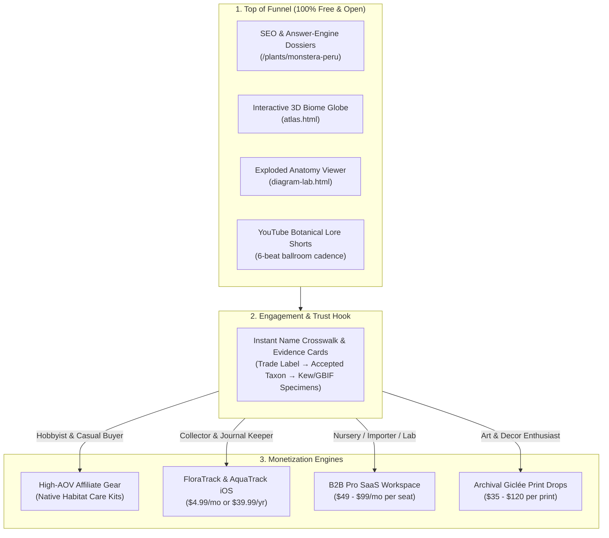

# Endemic Ecosystem: Full Monetization & Acquisition Blueprint
**Target Apps:** `FloraTrack` & `AquaTrack`  
**Web Acquisition Hub:** `Endemic` (`Projects/endemic-site`) & `Plant Trace`  
**Content Engine:** `Content Factory` (Channel 4 Botanical Lore + Channel 1 Aquarium)  
**Date:** 2026-08-15  
**Author:** Antigravity AI & Product Team  

---

## Executive Summary

The Endemic ecosystem (`FloraTrack` + `AquaTrack` + `Endemic Web Hub`) solves a massive structural problem in the botanical and aquascaping markets: **the confusion between trade names, commercial supply chains, and biological reality.**

Instead of competing against commoditized computer-vision plant identifiers (*PictureThis*, *Pl@ntNet*), FloraTrack is positioned as **"the evidence layer for plant names."** The free web layer acts as an indexable search engine trap, answering immediate label confusion with verifiable scientific citations, while systematically driving traffic into 4 high-margin revenue streams.

---

## 1. The Core Funnel Architecture: Free vs. Paid

---

## 2. What Users Get for FREE (Acquisition & Lead Magnets)

To maximize viral distribution, search ranking (Google AI Overviews, Perplexity), and social sharing, the following layers are completely free:

1. **Zero-Paywall Botanical & Trade Crosswalks:**
   * Instant search resolving any trade label (e.g. *"Monstera Peru"*, *"Green Galaxy"*, *"Thai Constellation"*, *"Mini Monstera"*) into its formal accepted binomial, synonym trail, and grower statement without requiring an account.
2. **Interactive Visual Exploration Tools:**
   * **3D Orthographic Biome Globe (`atlas.html`):** Real lat/lon coordinate plotting of preserved specimens projected over global biomes.
   * **Interactive Exploded Diagram Lab (`diagram-lab.html`):** Anatomical plant and aquatic cutaways with live HTML/SVG tooltips.
3. **Citation-Ready Evidence Briefs:**
   * Exportable and shareable summary cards categorizing sources by role: *Authority* (Kew POWO, IPNI), *Specimen* (GBIF, Herbaria), *First-Party* (Costa Farms, Breeders), and *Trade/Retail* (Lowe's, Etsy).
4. **Channel 4 Botanical Lore Shorts:**
   * High-drama 60-second stories (Victorian orchid smuggling, Linnaeus naming feuds, lethal houseplant toxins) linking to canonical dossiers.

---

## 3. The Four Monetization Engines (Detailed Breakdown)

### Stream 1: High-AOV Affiliate Gear & "Native Habitat Kits"
* **Mechanism:** Every free plant dossier and biotope profile features an **"Exact Native Habitat Kit"** instead of generic affiliate ads.
* **Product Matching:**
  * *Tropical Aroids:* High-porosity aroid bark mixes, moss poles, automated misting systems, high-PAR grow lights (Soltech, Sansi), humidity domes.
  * *Aquascaping & Biotopes:* Low-pH blackwater botanicals (Tannin Aquatics), UNS rimless aquariums, ADA Amazonia soil, Chihiros/Twinstar WRGB lighting, inline CO2 diffusers.
* **Conversion Surface:** Embedded directly below the biotope parameter breakdown on `endemic.app/plants/[slug]`, `endemic.app/gear`, and pinned comments on YouTube Shorts.
* **Economics:**
  * Average Order Value (AOV): $150 – $450
  * Affiliate Commission Rate: 5% – 12%
  * Expected Revenue per 1,000 unique dossier visits: **$45 – $120**

---

### Stream 2: Native iOS Field Journals (FloraTrack & AquaTrack Subscriptions)
* **The Value Proposition:** *"Free tells you what the evidence says. FloraTrack lets you keep, grow, and act on your collection over time."*
* **Paid Features ($4.99/mo or $39.99/yr):**
  * **Old Label History Vault:** Keep the original nursery tag record and trade name attached to the plant across 5+ years of repots, even as taxonomy updates.
  * **Taxonomic Reclassification Radar:** Push notifications when Kew or IPNI reclassifies a plant in the user's collection.
  * **Phylogenetic Bloom & Lineage Tracer:** Interactive evolutionary species tree connecting personal plants by discoverer, expedition, and clade.
  * **Custom Care & Maintenance Engine:** Predictive watering/fertilizer scheduling calibrated to the plant's native canopy PAR and humidity.
* **Economics:**
  * Pricing: $4.99/month or $39.99/year (with 7-day free trial).
  * Target Free-to-Paid Web-to-App Conversion: 1.8% – 3.2%.

---

### Stream 3: FloraTrack Pro (B2B SaaS for Nurseries, Importers & Labs)
* **The Value Proposition:** Automated compliance, patent clearance, and catalog reconciliation for commercial plant businesses.
* **Paid Tier ($49 – $99/mo per seat):**
  * **Bulk CSV/Shopify Catalog Resolver:** Upload 1,000+ SKU inventory lists; instantly resolve common names to valid botanical names, synonym flags, and USDA APHIS categories.
  * **USPTO & CPVO Plant Patent Clearance:** Verify whether a cultivar name or mutation carries active plant patents or trademark protections before propagation.
  * **CITES & Phytosanitary Documentation Assistant:** Generate export/import documentation packets linking commercial lots to verified taxonomic authorities.
* **Target Audience:** Rare plant nurseries, tissue culture laboratories, botanical gardens, and international plant brokers.

---

### Stream 4: Archival Botanical Art & Limited-Edition Print Drops
* **Mechanism:** Leveraging our curated archive of **2,252 high-resolution 19th-century scientific plates** (Bleeker, Gosse, Haeckel, Curtis Botanical Magazine) paired with modern vector exploded engineering diagrams.
* **Offerings:**
  * Museum-grade heavy matte giclée art prints (12x18, 18x24, 24x36).
  * Framed botanical explorer collector sets with embossed brass nameplates.
  * Waterproof field notebook inserts for serious collectors.
* **Economics:**
  * Retail Price: $35 – $120 per print.
  * Production Cost (Print-on-Demand via Prodigi/Gelato): $8 – $22.
  * Gross Margin: **68% – 78%**.

---

## 4. Projected Unit Economics & Revenue Forecast

| Metric / Stream | Month 3 (Pilot) | Month 6 (Growth) | Month 12 (Scale) |
|---|---:|---:|---:|
| **Monthly Free Web Visitors** | 25,000 | 120,000 | 500,000 |
| **Shorts / Video Monthly Views** | 100,000 | 650,000 | 2,500,000 |
| **1. Affiliate Revenue** | $850 | $4,200 | $18,500 |
| **2. iOS App Subscriptions (MRR)** | $480 (120 subs) | $3,600 (900 subs) | $16,000 (4,000 subs) |
| **3. B2B Pro SaaS (MRR)** | $245 (5 seats) | $1,470 (30 seats) | $5,880 (120 seats) |
| **4. Archival Print Sales** | $450 (15 orders) | $2,100 (70 orders) | $7,500 (250 orders) |
| **Total Monthly Revenue** | **$2,025** | **$11,370** | **$47,880** |
| **Annualized Run-Rate (ARR)** | **$24,300** | **$136,440** | **$574,560** |

---

## 5. Implementation Roadmap

1. **Sprint 1: Web Funnel & Affiliate Foundation**
   * Wire `plant-trace` static dossiers into `endemic-site` routing (`/plants/[slug]`).
   * Add high-conversion affiliate product modules below care parameter cards.
2. **Sprint 2: App Store Deep-Linking & Onboarding Handoff**
   * Implement `"Save to FloraTrack"` CTAs on web dossiers generating smart App Store / TestFlight deep links with pre-filled plant data.
3. **Sprint 3: Content Factory Video Integration**
   * Render initial batch of 5 botanical lore Shorts with pinned links to free web dossiers.
4. **Sprint 4: B2B Pro Portal & Print Drop Beta**
   * Launch CSV bulk name validator and Shopify Print-on-Demand integration.
