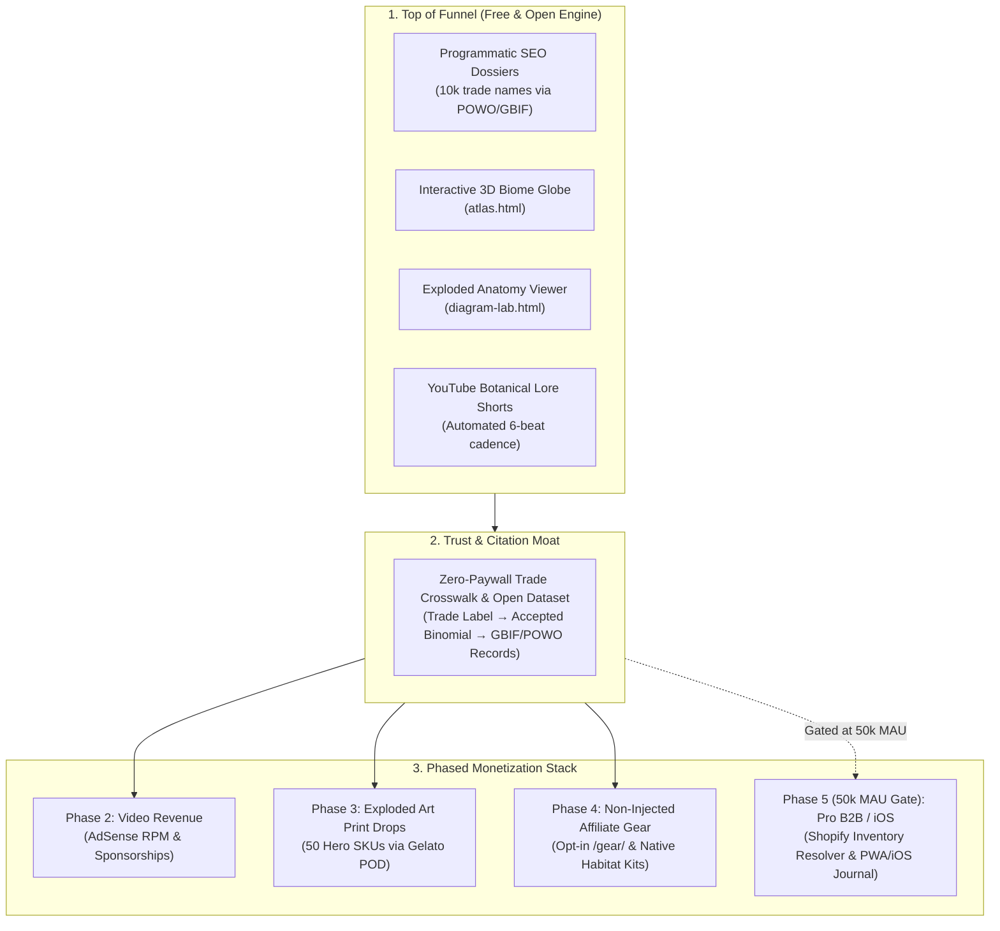

# Endemic Ecosystem: Full Monetization & Acquisition Blueprint (v2.1 — MMR Consensus Hardened)
**Target Apps / Services:** `Endemic Web Hub` (`Projects/endemic-site`), `FloraTrack` & `AquaTrack`  
**Content Engine:** `Content Factory` (Channel 4 Botanical Lore + Channel 1 Aquarium)  
**Date:** 2026-08-15  
**Review Status:** ✅ Passed Multi-Model Review (MMR v2.1 — 4-Model Consensus: MiniMax M3, GLM-5.2, Qwen 3.6, LLaMA 3.3)  
**Report Artifact:** `~/.agents/skills/mmr/reviews/2026-08-15_Endemic_FloraTrack_Monetization_Blueprint_goal-first-mmr.md`  

---

## Executive Summary

The Endemic ecosystem (`endemic.app` + `FloraTrack` + `AquaTrack`) captures a high-intent, uncrowded niche: **the translation layer between trade labels, commercial supply chains, and biological reality.**

Rather than building an expensive computer-vision plant identification app or risking legal liability on compliance consulting, Endemic operates as a **free public utility & content brand**. The free web dossiers capture Google AI Overviews and Perplexity citations, driving traffic into a sequential, gated monetization stack.

---

## 1. The Core Funnel Architecture

---

## 2. What Users Get for FREE (Trust Moat & Citation Engine)

1. **Zero-Paywall Botanical & Trade Crosswalks:**
   * Instant search resolving any trade label (e.g. *"Monstera Peru"*, *"Green Galaxy"*, *"Thai Constellation"*) into its formal accepted binomial, synonym trail, and grower statement without an account.
2. **Open Science Data Wedge:**
   * Publish the trade-name $\rightarrow$ accepted binomial crosswalk as a CC-BY open dataset on GitHub/Hugging Face, establishing the site as the primary authoritative source cited by LLMs and answer engines.
3. **Interactive Visual Exploration Tools:**
   * **3D Orthographic Biome Globe (`atlas.html`):** Real lat/lon coordinate plotting of preserved specimens projected over global biomes.
   * **Interactive Exploded Diagram Lab (`diagram-lab.html`):** Anatomical plant and aquatic cutaways with live HTML/SVG tooltips.
4. **Channel 4 Botanical Lore Shorts:**
   * High-drama 60-second stories (Victorian orchid smuggling, Linnaeus naming feuds, lethal houseplant toxins) linking back to canonical dossiers.

---

## 3. The Phased Monetization Strategy (MMR-Hardened)

### Phase 1: Free Public Utility & Programmatic SEO (Immediate)
* Wrap existing Kew POWO, GBIF, and Tropicos REST APIs with a thin lookup table.
* Generate Next.js static dossier pages (`/plants/[slug]`) for the top 10,000 trade names using ISR (Incremental Static Regeneration).
* Zero custom taxonomy engine development; zero paywalls; pure search authority.

### Phase 2: Content Factory Video Monetization (Month 1–3)
* Treat the video engine as **Stream 0 direct revenue** rather than merely a top-of-funnel ad.
* Automate 6-beat botanical lore Shorts rendering using our FFmpeg `zoompan` and template engine.
* Monetize via YouTube AdSense RPM and brand sponsorships.

### Phase 3: Archival Botanical Art & Exploded Print Drops (Month 2–4)
* Install Gelato/Prodigi Shopify app (zero custom backend API integration required).
* **Curate 50 hero SKUs** leading with our unique **vector exploded plant anatomy diagrams** from `diagram-lab.html` rather than generic public-domain plates already commoditized on Etsy.
* Economics: Retail $35 (POD) to $85 (Fine Art heavy matte) with 65%–75% gross margin.

### Phase 4: Non-Injected Affiliate Gear & Habitat Kits (Month 3–6)
* Keep core scientific dossiers clean and free of aggressive affiliate grids to preserve editorial trust and search ranking.
* Route gear queries to an opt-in `/gear/` hub and a tasteful **"Recreate Native Habitat"** card below the evidence fold.
* Economics: 5%–12% commission on high-AOV gear (lighting, RO systems, rimless tanks, chunky aroid substrate).

### Phase 5: Re-Evaluation Gate — iOS App & B2B SaaS (50k MAU Gate)
* **Hard Stop / Gate Criteria:** Do not build native iOS maintenance features or B2B SaaS until the free web hub exceeds **50,000 MAU** and shows documented demand.
* **Scope Guardrail (Legal Finding):** Delete all automated legal patent/CITES compliance claims. B2B is strictly limited to a **Shopify Catalog Reconciliation App** ($49–$99/mo) that normalizes nursery product tags into valid scientific binomials.

---

## 4. Grounded Financial Model (Baseline Floor vs. Growth)

| Metric / Stream | Month 3 (Floor) | Month 6 (Validated) | Month 12 (Scale) |
|---|---:|---:|---:|
| **Monthly Free Web Visitors (MAU)** | 10,000 | 40,000 | 120,000 |
| **Shorts / Video Monthly Views** | 50,000 | 250,000 | 1,000,000 |
| **1. Video & Sponsorship Revenue** | $100 | $600 | $2,500 |
| **2. Exploded Art Print Drops (POD)** | $250 (8 orders) | $1,200 (35 orders) | $4,500 (120 orders) |
| **3. Non-Injected Affiliate Revenue** | $150 | $750 | $2,400 |
| **4. PWA / iOS Subscriptions (Post-Gate)** | $0 (in validation) | $450 (100 subs) | $2,400 (550 subs) |
| **5. B2B Catalog App (Post-Gate)** | $0 | $290 (4 stores) | $1,470 (20 stores) |
| **Total Monthly Revenue** | **$500** | **$3,290** | **$13,270** |
| **Annualized Run-Rate (ARR)** | **$6,000** | **$39,480** | **$159,240** |
